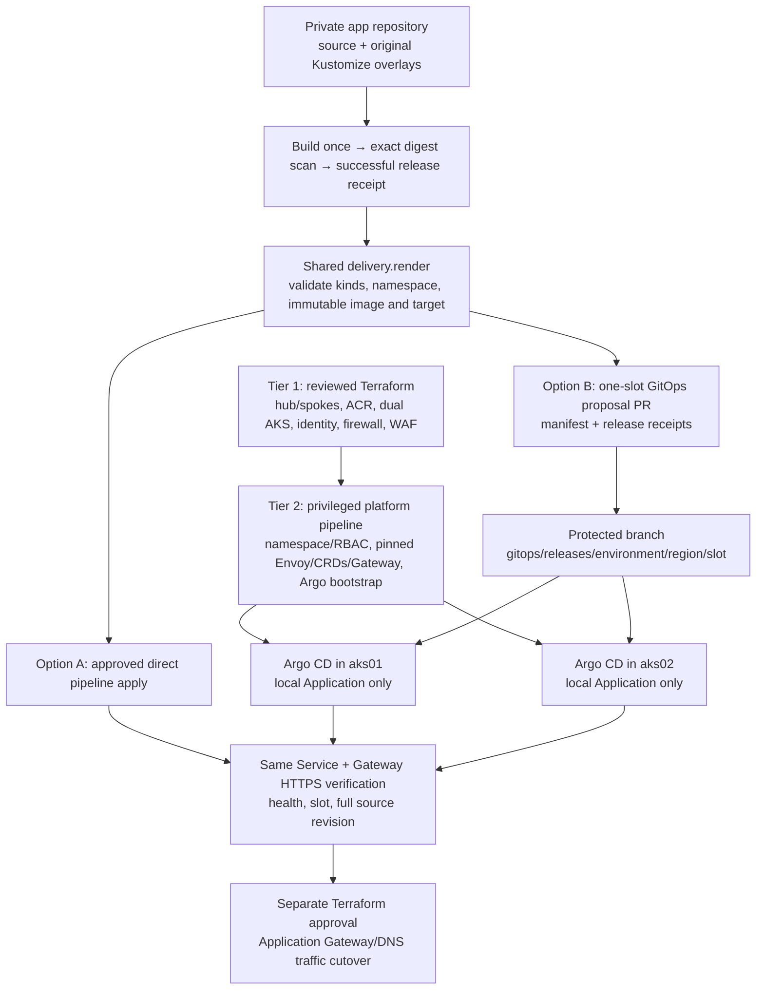

# Argo CD design: the same release contract with Git reconciliation

Read this design first, then [deployment](argocd-deployment.md), [operations](argocd-operations.md) and [troubleshooting](argocd-troubleshooting.md). The [sample application](https://github.com/MikeeeGit/aks-platform-demo) contains the source, original Kustomize overlays and example callers.

Argo CD is an additional application deployment method. **Argo CD does not require Kustomize:** it can reconcile plain Kubernetes YAML, or render supported tools such as Kustomize and Helm. This reference keeps the original Kustomize overlays in CI so both delivery methods share one source. Direct delivery applies the validated render from a pipeline; GitOps delivery commits that same render to protected Git and Argo reconciles the plain `manifest.yaml`. There is no second Kustomize wrapper or second rendering step inside Argo. Existing direct pipelines, examples and platform setup remain available.

## Three tiers and one owner for each resource



Terraform owns Azure resources. The platform tier owns namespaces, controller/CRD lifecycle, Gateway and identity prerequisites. The application tier owns Deployment, Service, application ServiceAccount/CSI binding, HTTPRoute, NetworkPolicy, HPA and disruption budget. Argo bootstrap is a privileged platform operation; ordinary app promotion cannot select a new controller version or grant itself cluster administration.

Choose direct delivery or Argo ownership for a given application/slot. Two active reconcilers can overwrite each other. The [handoff procedure](argocd-operations.md#switching-between-direct-and-argo-delivery) keeps both methods usable without assigning both to the same live resources.

## Independent cluster topology

Each AKS cluster has its own Argo namespace, controller, repository server, Redis and private API/UI server. Its Application targets `https://kubernetes.default.svc` and that cluster's slot directory. No central controller stores credentials for the other AKS cluster. An Argo outage on aks02 does not remove aks01's reconciliation service; loss of either controller does not itself stop already running application pods.

This deliberately small topology is suitable for learning and an initial system. A central management cluster and ApplicationSets are valid future architectures, but require separate credential, availability and ownership design. They are not silently included here.

One private consumer repository holds application source and desired state:

```text
deploy/gateway-api/overlays/pprd/uks/aks01/   original application inputs
deploy/gateway-api/overlays/pprd/uks/aks02/
delivery.gateway.apps.json                explicit Azure/slot/verification targets
gitops.config.json                          private Git + Argo + API endpoint bindings
gitops/releases/pprd/uks/aks01/
  manifest.yaml                           exact validated shared render
  release.json                            source/digest/target/manifest hashes
  build-release.json                      security-gated build receipt
  ingress-ca.pem                          optional public CA only
gitops/releases/pprd/uks/aks02/
```

The original overlays remain canonical. Generated releases are intentionally self-contained. The Application explicitly selects `source.directory.include: manifest.yaml` and `recurse: false`, so receipt JSON and the optional public CA are never treated as Kubernetes resources. Argo needs no Kustomize executable, external bases, custom plugins, shell hooks, mutable image tags or internet-time rendering dependencies for this app. A proposal regenerates the manifest from the **build receipt's source commit**, not the operator's working tree. Do not hand-edit generated YAML to bypass its original source and receipts.

Native Kustomize with Argo is also a standard option: an Application can point directly to a committed overlay and Argo renders it. We avoid that additional rendering boundary here because CI already produced and validated the exact source/digest/target bundle shared with direct delivery. The app topology is not duplicated by hand. See [Argo directory mode](https://argo-cd.readthedocs.io/en/stable/user-guide/directory/) and [native Kustomize support](https://argo-cd.readthedocs.io/en/stable/user-guide/kustomize/).

A separate configuration repository is a possible future split. The included PR publisher intentionally writes only the same private consumer repository; cross-repository publication is not implemented.

## Release and promotion guarantees

The existing build performs the image build and security scan, then records the immutable digest and full source commit. The proposal workflow selects an explicitly identified successful trusted build in the same private repository, checks producer metadata and the security gate, and invokes the existing shared renderer.

A proposal affects one slot. Its branch/PR never merges itself, requests an Argo sync, changes live DNS, or rebuilds for another cluster. Reviewers inspect the source/digest pair, target slot, manifests, configuration and receipts. After a protected merge, a release operator explicitly syncs the full reviewed GitOps commit and verifies the deployed application. The helper compares the reviewed bundle with every exact committed slot file in the supplied private clone, checks its configured cluster API endpoint against kubeconfig and rejects disabled TLS verification before any cluster mutation. Only then promote another slot or approve traffic cutover.

Three identifiers have different meanings:

| Identifier | Meaning |
|---|---|
| Application source commit | Source/Dockerfile/overlay snapshot used to build and render the release; returned by the application `/version` endpoint |
| Image digest | Exact registry content promoted to either slot |
| GitOps commit | Protected Git commit containing desired state for the selected slot; reported by Argo sync |

A rollback is a new reviewed Git commit restoring a previously approved slot bundle. It keeps source and digest aligned and preserves audit history. It does not restore application data, downgrade CRDs or change traffic.

Manual sync is the default. Automatic pruning, automatic namespace creation, cascading Application deletion finalizers and automated self-heal are absent. OutOfSync therefore calls for review; it is not silently repaired. The HPA owns the selected Deployment's replica count: Argo ignores only that field and respects the exclusion while applying. Other drift stays visible. The [sync options](https://argo-cd.readthedocs.io/en/stable/user-guide/sync-options/) document describes these Argo mechanisms.

## Security and control boundaries

The [bootstrap](../examples/argocd-platform/README.md) uses Argo CD v3.5.3, version-specific manifest hashes, separate CRD hashes and immutable image digests in [argocd-lock.json](../argocd-lock.json). At the time of selection, the stable 3.5 line lists Kubernetes1.35 among its tested versions, matching the acceptance cluster line. This is version compatibility evidence, not an AKS certification. [Official compatibility table](https://argo-cd.readthedocs.io/en/stable/operator-manual/tested-kubernetes-versions/).

The namespace installation grants no Argo ServiceAccount a cluster-wide administrative binding. The controller has an explicit application namespace Role; the server has a read-only role. Its local-cluster registration contains no static token and uses a projected local ServiceAccount credential. Cache scope, Kubernetes RBAC and AppProject restrictions all apply. The default project denies all; the generated application project allows one exact repository, namespace and resource-kind set.

The Argo namespace is privileged: its maintainers can modify Projects, Applications and Git credentials. Only trusted platform administrators should write it. Application namespace write access remains a trusted application-team boundary, including its workload identity/CSI declarations. The Role is scoped by namespace and resource kind, not object name: ordinary Envoy proxy Deployments/Services in the same namespace can also be affected by an authorized manifest. Gateway/EnvoyProxy custom resources remain excluded. This is not hostile-tenant isolation.

Argo receives **read-only Git credentials**. The separate proposal job gets repository/PR write permission but no Kubernetes or Azure deployment credential. GitHub uses an explicit repository-scoped publisher token so PR validation can run; Azure uses the same-repository build identity with reviewed branch/PR permissions. The protected branch and review/build policies are essential controls. Receipt hashes detect changed bytes relative to a trusted approval; they do not sign releases or protect against a compromised maintainer who can rewrite source, policy and receipts.

The default server is private ClusterIP, anonymous access is disabled and the default authenticated role has no permissions. Entra/OIDC SSO, private server DNS/TLS, group mapping, credential rotation and enterprise monitoring require environment-specific configuration. The example does not claim these are provisioned turnkey.

## What remains the same in the request path

Application Gateway WAF → private HTTPS Envoy listener → HTTPRoute → ClusterIP Service → application pods remains the maintained path. The application speaks HTTP behind Envoy; this is not application-pod mTLS. AKS workload identity and Key Vault CSI still supply the real TLS Secret. The Argo controller does not read or write that application Secret.

Argo Synced/Healthy is necessary but insufficient. The shared verifier also checks the exact Deployment image digest, application readiness/slot/source revision and actual Envoy HTTPS with certificate/hostname validation. Port-forward probes exercise the in-cluster proxy but bypass Azure ILB and Application Gateway. Live qualification must separately verify private IP allocation, routing, DNS, CSI/identity, ACR access, WAF/preview path and approved traffic rollback.

## Evidence and limits

Static tests inspect the installation, immutable pins, restrictive project/RBAC construction, rejected receipt changes and preserved original manifests. Hosted acceptance runs actual Argo processes and Git reconciliation on disposable Kubernetes clusters, alongside the existing direct deployment acceptance. Inspect the exact run SHA and retained reports before citing a pass; a test definition alone is not execution evidence.

The local fixture uses a temporary registry/Git server, temporary TLS material and kind transport. It does not establish Azure credentials, private repository authentication, OIDC SSO, Azure load balancers, Key Vault, firewall/CNI enforcement or high-availability failover. The [deployment guide](argocd-deployment.md#qualify-the-live-azure-path) and [operations manual](argocd-operations.md) cover those additional checks.
