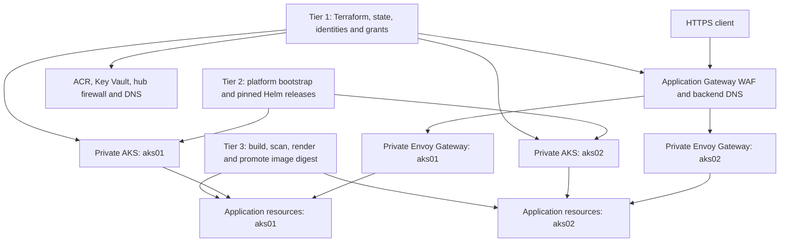

# Containerization platform plan

This is a **sanitized and updated adaptation** of the original containerization plan for a repeatable Azure application platform built with Terraform, Azure DevOps, AKS, Helm and Kustomize. It preserves the three-tier architecture and technical requirements, including Appendices A–P. Organization-specific deployments, addresses, identities, applications, historical costs and delivery-status statements have been removed. This document describes the intended system; a requirement is not evidence that an implementation has passed acceptance.

The maintained ingress implementation is **Gateway API with Envoy Gateway**, replacing community ingress-nginx. Application Gateway WAF, private cluster frontends, Key Vault CSI, managed identities, federated credentials and separate deployment tiers remain part of the design. See the [ingress migration](ingress-migration.md) for compatibility testing and migration decisions.

## Reading this plan

Start with the [three-tier deployment guide](three-tier-deployment-system.md) for the implemented interfaces and the [operator walkthrough](operators-walkthrough.md) for their use. The [requirements traceability matrix](containerization-requirements.md) records implementation status and remaining gaps. The [worked example](https://github.com/MikeeeGit/terraform-delivery-templates/blob/main/docs/azure/three-tier-worked-example.md) separates disposable Kubernetes rehearsal from actual Azure deployment. [Delivery design and compatibility](source-provenance.md) maps the original template responsibilities to public code.

| Status used here | Meaning |
|---|---|
| Implemented interface | Public code or a maintained profile exists; the linked tests and run evidence define what has been validated. |
| Azure qualification required | Success depends on real Azure identities, networking, service behavior or application dependencies. Local rendering and kind cannot establish it. |
| Planned extension | A retained requirement or design option without a complete, qualified public implementation. |

The implemented core includes infrastructure roots, explicit dual-slot targets, identity and authorization handoffs, pinned platform releases, immutable application promotion, Gateway API/CSI configuration and direct or Argo CD delivery. Linkerd, Windows pools, scheduled Job/CronJob delivery, business database migration, automatic maintenance pages and full regional disaster recovery remain planned extensions unless separately implemented and qualified. Dynatrace is preserved as an optional design requirement in Appendix P and is excluded from the current worked example. Generic Helm support does not by itself implement any of those services.

Contents: [scope](#scope-and-objectives), [architecture options](#infrastructure-options), [three tiers](#three-tier-deployment-architecture), [delivery phases](#delivery-phases), [tenant migration](#tenant-migration-options), [acceptance](#acceptance-and-operations), and Appendices [A](#appendix-a--comparison-with-a-vm-platform), [B1](#appendix-b1--initial-network-and-kubernetes-sizing), [B2](#appendix-b2--measured-sizing-and-cost-model), [C](#appendix-c--reference-library), [D](#appendix-d--azure-and-kubernetes-authorization), [E](#appendix-e--helm-in-azure-devops), [F](#appendix-f--kustomize-application-delivery), [G](#appendix-g--managed-identities-and-federated-credentials), [H](#appendix-h--dual-aks-blue-green-deployment), [I](#appendix-i--terraform-framework), [J](#appendix-j--complete-environment-build-and-removal), [K](#appendix-k--network-policy), [L](#appendix-l--tls-and-certificate-delivery), [M](#appendix-m--service-mesh-options), [N](#appendix-n--planned-linkerd-integration), [O](#appendix-o--who-gets-which-permissions), [P](#appendix-p--planned-dynatrace-integration).

## Scope and objectives

The target workload is a Linux web application with several supporting APIs and optional scheduled jobs. Each service has its own image, configuration, resource requirements and health checks. Multiple application stacks can share an infrastructure environment while retaining separate namespaces, service accounts and release configuration. A seven-component stack is used as an illustrative sizing model in Appendix B2; the public sample app is smaller and does not reproduce an organization's business services.

The objectives are to:

1. Recreate the infrastructure, platform services and applications from reviewed configuration, including access rights and workload federation.
2. Separate cluster upgrades, platform-controller upgrades and application releases so each can be tested and approved independently.
3. Deploy the same image digest to one or both AKS slots, validate the inactive slot, switch traffic deliberately and retain a tested recovery path.
4. Use private AKS endpoints, reviewed network paths, WAF, controlled egress and environment-scoped secret access.
5. Provide local rehearsal, private Azure qualification, operating procedures and an evidence trail that another engineer can follow.
6. Expand through development, preproduction, production and a recovery region using the same module and template contracts, with reviewed differences in capacity and resilience.

Future Windows workloads require a separately reviewed pool/network design. Database hosting, backup, schema migration, data replication and third-party integrations are explicit dependencies; rebuilding stateless pods does not recreate business data.

## Infrastructure options

| Option | What changes | Useful when | Required review |
|---|---|---|---|
| New environment in an existing nonproduction subscription | New VNet, gateway and AKS resources with isolated state | Establishing a complete reference environment before production migration | Address allocation, quota, identity boundaries and temporary duplicated cost |
| Add AKS to existing nonproduction infrastructure | Reuse selected network, gateway or registry resources through explicit IDs or reviewed state outputs | A constrained proof where existing dependencies must stay in place | Ownership, subnet capacity, routing and impact on existing consumers |
| Rebuild in another established tenant | New subscriptions and resources under that tenant's controls | Adopting another organization's identity and governance boundary | Federation, RBAC, DNS, connectivity, policies and data migration |
| Build in a new tenant | Bootstrap identity, state, governance, networking and all three tiers | Deliberate full isolation | Every tenant-level dependency and operational responsibility |

A separate nonproduction build is the reference approach. Preserve existing environments until the replacement has passed acceptance. Brownfield integration remains valid, but imported resources and resources referenced by ID need explicit ownership: never let two states manage the same object. Importing is a reviewed migration operation, not a prerequisite to demonstrate the new design.

## Three-tier deployment architecture



The two backend paths express active and preview destinations. Deploying to the preview cluster does not itself change the active traffic target.

### Tier 1: infrastructure and identity

Terraform owns VNets, subnets, NSGs, route tables, peering, private DNS/links, private endpoints, firewall policy, AKS, node pools, ACR and Application Gateway/WAF. The relevant roots also own managed identities, scoped Azure role assignments and federated credentials. Key Vault resources and permissions are code; secret values arrive through a separate authorized secret-management process.

Bootstrap creates state storage, per-purpose CI identities, federation and protected service connections before the ordinary deployment identities can use them. Preserve the separation between the privileged bootstrap operator, Terraform plan/apply identities, platform identity, application identity and runtime workload identities. These are different principals even when the lab uses one subscription.

The infrastructure handoff supplies actual cluster names, resource IDs, OIDC issuers, workload client IDs, service-account subjects, frontend addresses, vault references and CI permission bindings. Consumer configuration must be generated or checked against those applied outputs. An invented client ID or a ServiceAccount annotation cannot establish Azure access.

### Tier 2: cluster platform services

Use a separate platform consumer repository and pipeline to install and maintain namespaces, workload ServiceAccounts, approved CRDs, pinned Helm charts and common manifests. The current [Envoy profile](../examples/platform-envoy/README.md) is the reference ingress implementation. Namespace/application permission bootstrap is a distinct operation; it is not a substitute for installing controllers and their services.

Platform work includes controller versions, private frontend configuration, trusted proxy boundaries, certificate references, resource requests, availability and diagnostics. Inspect managed AKS add-ons before adding equivalents; for example, do not create a second metrics installation merely because a historical checklist mentioned metrics-server.

Helm pipelines are the retained baseline. GitOps can own selected platform releases in a future reviewed profile; it must not compete with a pipeline for the same release. Terraform's Helm provider is an architectural option, but using it changes lifecycle ownership and should not silently fold the platform tier into infrastructure state.

### Tier 3: application delivery

The application pipeline builds once, pushes to ACR, scans the resulting immutable digest and records its source/build provenance. Kustomize combines common manifests with environment and application-variant overlays. Deployment includes configuration, workload ServiceAccount binding, CSI resources, routes, probes, resources and supported HPA configuration. Scheduled Job/CronJob delivery is a retained requirement; the current application's allowed-kind contract does not support those resource kinds.

Direct pipelines prepare and approve rendered inputs, apply to the selected slot, then verify rollout and real HTTPS host/path behavior. The additive Argo CD route stores reviewed desired state in Git and lets Argo reconcile it. Kustomize renders configuration in either method; it is not a competing deployment controller. Use [delivery methods](delivery-methods.md) to choose one writer for each application resource set.

Promote a successful existing build without rebuilding it. Image promotion, application readiness and traffic cutover are separate operations. An application identity must not need cluster-admin, Azure role-assignment rights or permission to alter the platform controller.

## Delivery phases

| Phase | Work | Exit evidence |
|---|---|---|
| 1. Assessment and planning | Inventory services, dependencies, data, networks and current release behavior; create Dockerfiles/manifests; choose identities and delivery ownership | Reproducible image builds, dependency/port matrix, address and capacity plan, reviewed architecture and migration criteria |
| 2. Infrastructure and platform setup | Bootstrap state/trust; provision hub/spokes, egress, vault/registry, AKS and gateway; establish platform permissions; install common services | Applied outputs, approved plans, actual CI logins, private connectivity, controller/CRD readiness and explicit ownership |
| 3. Application deployment and testing | Deploy the web app/APIs/jobs; validate secrets, configuration, ingress, policy and scaling; exercise repeat deployment and recovery | Functional and load results, negative authorization tests, real TLS/CSI evidence, inactive-slot upgrade, cutover and rollback |
| 4. Environment rollout | Repeat the reviewed releases in higher environments and the recovery region; migrate traffic and data in controlled steps | Environment-specific acceptance, recovery exercise, approved retirement of replaced resources |

### Phase 1 detail

Inventory network ranges, DNS resolvers, peering, NSGs, routes, public and private endpoints, databases, storage, certificate authorities, registry dependencies and external APIs. Capture every manual adjustment as a reviewed configuration change. Identify stateless components, persistent volumes, scheduled jobs, sessions and schema compatibility before choosing a rollback strategy.

Develop Linux images locally, define health probes and create base manifests for every service. Establish a Linux build worker or hosted build path separately from a private deployment worker. Scan images and keep the build reproducible. Validate environment overlay rendering locally before using Azure credentials.

### Phase 2 detail

Allocate nonoverlapping node, pod and service ranges. Give each cluster its own node subnet; reserve separate subnets for Application Gateway, private endpoints and approved management connectivity. Configure hub/spoke routing, both sides of peering and DNS links. Do not automatically resize or repurpose an occupied subnet.

Provision private AKS with managed Entra authentication, the selected authorization mode, OIDC issuer, Workload Identity, reviewed Linux system/user pools and explicit outbound routing. Grant kubelet registry pull access and runtime identities only their required vault/data access. Registry private endpoints require a supporting SKU; the small Standard ACR example uses authenticated public registry endpoints and must not be described as a private-link registry.

Application Gateway owns HTTPS listeners, WAF policies, backend pools/settings, trusted backend roots, probes and rewrites. It connects to private per-slot Envoy frontends. Establish certificate material and identity grants before asserting backend TLS health. Diagnostic destinations, retention, persistent storage and backup requirements must be explicit.

Private workers and authorized operators need both DNS/routing to the private API and valid identity/RBAC. A successful port-forward is useful application diagnosis, but bypasses the external WAF/ingress path and cannot qualify it.

### Phase 3 detail

Test all service routes, database connections, background jobs, outbound APIs, configuration changes, CSI mounts, certificate rotation and failure behavior. Test denied namespace access as well as permitted traffic. Compare resource requests to measured CPU/memory and test pod disruption, node replacement, autoscaling and controller upgrades.

Run clean builds and repeated applies to expose missing state ownership or manual configuration. Record the source commit, shared template commit, image digest, cluster slot, certificate trust, test report and run URL. Test both direct deployment and Argo ownership where both methods are offered. A successful Helm install or Deployment rollout is insufficient evidence of external telemetry, business transactions or traffic cutover.

### Phase 4 detail

Promote the same reviewed modules, charts and image digests with environment-specific inputs. Size production and recovery independently; the lowest-cost lab is not a production availability recommendation. Keep old traffic targets and data recovery options until acceptance and the rollback window close.

Recovery-region work includes image availability, secret/certificate distribution, DNS/routing, database recovery, backup restore and documented RTO/RPO. A second AKS cluster in the same region does not provide regional disaster recovery. Decide explicitly whether recovery vaults are independent and how authorized secret/certificate replication is performed; do not assume another region automatically has equivalent permissions and data.

## Tenant migration options

**Subscription directory transfer** preserves many resource objects but requires a resource-specific support assessment and an identity/access recovery plan. Inventory managed identities, service principals, role assignments, federation, Key Vault authorization, pipeline connections, state access, policy and network management before the change. Re-establish trust and verify every tier in nonproduction before considering another subscription. State storage must remain recoverable throughout; moving it is a separately reviewed operation.

**Parallel rebuild in a destination tenant** bootstraps new state and identities, deploys the reviewed network/platform, restores or migrates data, verifies connectivity, then moves traffic. Keep the source environment until acceptance. Explicitly plan database migration, VM coexistence, vault consolidation, firewall rules and private DNS. A template copy alone does not migrate tenant trust or data.

Measure actual application/database latency across the proposed route. Being in the same tenant or VNet is not a substitute for measurement, and this plan makes no guaranteed latency claim. Database migration and directory transfer remain consumer-specific work, outside the sample app's acceptance scope. Consult Microsoft's [subscription directory transfer guidance](https://learn.microsoft.com/en-us/azure/role-based-access-control/transfer-subscription).

## Acceptance and operations

The release record should establish four different outcomes:

| Evidence | Establishes | Does not establish |
|---|---|---|
| Static checks and rendered templates | Valid inputs, policy contracts, dependency pins and guarded failure paths | A reachable cloud endpoint |
| Two-cluster kind rehearsal | Controller/application integration and real HTTPS promotion/switch/rollback through the test adapter | Azure identity, WAF, UDR, private DNS, CSI or billing behavior |
| Private Azure qualification | Actual federated CI, permissions, private networking, Azure service integration and stable endpoint switching | Untested load, business workflows or regional data recovery |
| Application/recovery acceptance | The tested business behavior, data compatibility and recovery objectives | Features absent from the recorded test cases |

Routine operations cover cluster/node upgrades, controller/CRD upgrades, image rebuilds, certificate/secret rotation, permission review, alert delivery, cost review and tested removal. Track change ownership by tier. Retain logs without secret values. Re-run relevant acceptance after changes to networking, identity, ingress or delivery ownership. [Testing](testing.md), [promotion](promotion.md) and [Argo operations](argocd-operations.md) provide the maintained procedures.

## Appendix A — Comparison with a VM platform

| Concern | Container platform | VM platform |
|---|---|---|
| Release unit | Immutable image plus declarative workload configuration | Image/package plus machine configuration |
| Scaling | Pod and node scaling with requests, limits and capacity constraints | VM scaling and application-specific distribution |
| Recovery | Reconciliation and rescheduling, subject to data and capacity dependencies | VM/application recovery automation and backups |
| Configuration | Versioned infrastructure, platform and app ownership | Equally automatable with IaC; portal-only changes create drift |
| Security | RBAC, pod isolation, image supply chain and node/controller maintenance | OS/application hardening, access controls and patching |
| Cost | Can improve density; adds cluster, gateway, monitoring and operational costs | May be cheaper for small or steady workloads |
| Portability | Kubernetes APIs help, while Azure integrations remain provider-specific | Depends on OS, runtime and infrastructure dependencies |

The improvement sought is reproducible, reviewed operation: consistent modules and tags, protected pipelines, saved-plan review, explicit permissions, auditable releases, drift detection and documented recovery. Kubernetes does not automatically make a service cheaper, secure, highly available or compliant. Likewise, reverting Terraform source is a new proposed change, not an automatic rollback of state or data.

## Appendix B1 — Initial network and Kubernetes sizing

Size from peak workload demand, node allocatable resources, DaemonSets, system services, controller overhead, pod limits, failure tolerance and upgrade surge. Keep application stacks and infrastructure environments distinct: several stacks may occupy namespaces in one cluster, while each blue/green cluster must be able to carry the intended active workload.

Azure CNI Overlay assigns pod addresses from a separate pod range, conserving node-subnet addresses. Node subnet capacity still needs Azure-reserved addresses, maximum nodes across all pools, surge/replacement capacity, internal frontends and any other consumers. Plan pod/service ranges against every connected network and both clusters. The original small-subnet calculation is illustrative, not a recommendation to shrink an existing Application Gateway subnet. See [Azure CNI Overlay](https://learn.microsoft.com/en-us/azure/aks/azure-cni-overlay).

A hypothetical `/26` has 64 addresses, with five reserved by Azure. Eight nodes leave 51 addresses **before** internal frontends, surge and other consumers are counted. Check the complete allocation instead of treating that remainder as guaranteed future capacity.

For an illustrative 8-vCPU/32-GiB node with a provisional 25% overhead allowance, use 6 CPU and 24 GiB as an initial planning budget. Replace this assumption with measured allocatable capacity before acceptance:

```text
pods_per_node = floor(min(allocatable_cpu / pod_cpu_request,
                          allocatable_memory / pod_memory_request,
                          remaining_pod_slots))
nodes = ceil(required_pods / pods_per_node)
```

| Request per pod | Illustrative pods/node | Nodes for 52 pods | Nodes for 100 pods |
|---|---:|---:|---:|
| 0.5 CPU / 1 GiB | 12 | 5 | 9 |
| 1 CPU / 2 GiB | 6 | 9 | 17 |
| 1.5 CPU / 3 GiB | 4 | 13 | 25 |
| 2 CPU / 4 GiB | 3 | 18 | 34 |
| 2.5 CPU / 5 GiB | 2 | 26 | 50 |
| 3 CPU / 6 GiB | 2 | 26 | 50 |

These counts exclude additional resilience and surge requirements. Heterogeneous workloads need bin-packing and load tests, not just an average-pod calculation. Reserve system capacity and use separate application pools in the production design.

The historical suggestion to use burstable B-series system nodes is not carried forward. Check current [AKS system-pool restrictions](https://learn.microsoft.com/en-us/azure/aks/use-system-pools); the reviewed public disposable profile uses two 4-vCPU Linux system nodes per slot with application scheduling explicitly enabled, and no user pool. It is a functional lab profile. Windows pools and their image lifecycle are a separate extension; Azure-managed Cilium currently requires Linux.

## Appendix B2 — Measured sizing and cost model

Use this anonymized seven-component profile as a worksheet, not as performance evidence for the public demo or as universal application defaults:

| Component | Memory request | CPU request | Memory limit | CPU limit |
|---|---:|---:|---:|---:|
| Web frontend | 1536 MiB | 2500m | 1536 MiB | 3000m |
| API A | 256 MiB | 500m | 512 MiB | 1000m |
| API B | 256 MiB | 250m | 512 MiB | Unspecified |
| API C | 512 MiB | 500m | 512 MiB | 1000m |
| API D | 128 MiB | 500m | 256 MiB | 1000m |
| API E | 128 MiB | 500m | 256 MiB | 1000m |
| API F | 1024 MiB | 500m | 2048 MiB | Unspecified |

One replica of every component requests 3.75 GiB and 5.25 CPU, with aggregate memory limits of 5.5 GiB. There is no finite aggregate CPU limit while individual limits remain unspecified. Record why a limit is omitted and test throttling/OOM behavior when choosing limits.

Calculate each environment from actual component replicas and shared dependencies; the number of web frontends need not equal the number of API stacks. Include platform pods, sidecars, monitoring agents, disruption budgets, autoscaler bounds and upgrade headroom. A standby user pool at zero still leaves system/platform costs and requires scale-up and readiness time. A recovery environment must meet its chosen restoration objectives, not simply copy a production replica count.

Replace historical commercial cost tables with a current region/currency estimate using the [Azure pricing calculator](https://azure.microsoft.com/en-us/pricing/calculator/) or [Retail Prices API](https://learn.microsoft.com/en-us/rest/api/cost-management/retail-prices/azure-retail-prices). Include node/worker compute and disks, AKS tier, firewall deployment/data, gateway fixed/capacity charges, IPs, load balancers, private endpoints/DNS, registry, storage, telemetry, backup and transfer. During migration, count both old and new infrastructure until the old resources are actually retired. Autoscale bounds and budget alerts are not a guaranteed spending cap.

## Appendix C — Reference library

Recheck supported versions and service limits when implementing a profile. These public references replace organization-specific standards and wiki links:

- [AKS baseline architecture](https://learn.microsoft.com/en-us/azure/architecture/reference-architectures/containers/aks/baseline-aks)
- [AKS best practices](https://learn.microsoft.com/en-us/azure/aks/best-practices)
- [Network connectivity and security](https://learn.microsoft.com/en-us/azure/aks/operator-best-practices-network)
- [Storage and backup](https://learn.microsoft.com/en-us/azure/aks/operator-best-practices-storage)
- [Workload Identity](https://learn.microsoft.com/en-us/azure/aks/workload-identity-overview)
- [Key Vault CSI provider](https://learn.microsoft.com/en-us/azure/aks/csi-secrets-store-driver)
- [Azure Pipelines AKS delivery](https://learn.microsoft.com/en-us/azure/aks/devops-pipeline)
- [Gateway API](https://gateway-api.sigs.k8s.io/) and [Envoy Gateway](https://gateway.envoyproxy.io/docs/)

## Appendix D — Azure and Kubernetes authorization

Treat these as separate controls:

1. **Authentication to Azure:** an actual operator or federated CI principal obtains an Entra token.
2. **Azure management authorization:** scoped Azure roles permit operations such as reading cluster user credentials, managing resources or reading vault data.
3. **Kubernetes API authorization:** either the configured Azure RBAC integration or native Kubernetes Roles/Bindings permits particular API operations.
4. **Runtime Azure access:** a pod's projected ServiceAccount token is exchanged through its exact federated credential for its workload identity.

Do not infer the Kubernetes authorization mode solely from an Entra license name. The public [native authorization profile](native-azure-authorization.md) uses managed Entra authentication with explicit Kubernetes permissions; the existing Azure RBAC profile is documented separately. Microsoft's [AKS authorization guidance](https://learn.microsoft.com/en-us/azure/aks/entra-id-authorization) distinguishes the integration.

An operator performs the [initial platform CI bootstrap](platform-ci-bootstrap.md) under explicit authority. The platform identity then establishes the application namespace permissions. Discover the actual authenticated Kubernetes username; do not assume that an Entra object/client UUID is necessarily its Kubernetes subject. Re-run discovery and reviewed bootstrap after a rebuild where the relevant binding changes. Test an allowed application change and a denied platform/other-namespace change.

Routine application delivery uses Entra user credentials, isolated kubeconfig/context and namespace-scoped permissions. Historical subscription-wide administrator grants and `get-credentials --admin` app deployments are not the public default. Terraform role-assignment bootstrap may need stronger privilege than an ordinary resource apply; keep that grant explicit, scoped and separately controlled.

## Appendix E — Helm in Azure DevOps

Helm owns the lifecycle of selected platform packages. Pin the chart version, package digest, values, runtime images and any required CRD bundle. Keep the same configuration contract for both clusters and choose the target slot explicitly.

| Operation | What to review | Boundary |
|---|---|---|
| Offline `helm template` | Rendered objects for the exact chart, values and Kubernetes version | Does not read the live cluster or prove installation behavior |
| Optional pinned Helm diff tooling | Proposed differences against a release or cluster | Live comparison needs cluster access; rendering/hook behavior can differ |
| Approved upgrade/install | Exact reviewed package, target, timeout and readiness results | Helm readiness is not end-to-end application or telemetry acceptance |

The maintained [platform lifecycle](platform-services.md) prepares hash-bound bundles, manages CRDs explicitly, preserves existing namespace security metadata and uses `helm upgrade --install`. Review CRD compatibility and admission policies before upgrading. Do not uninstall a working controller before every install, force CRD conflicts, or ignore failures.

The original optional diff example is a design requirement for useful previews, not an assertion that the public engine installs helm-diff. If adopting that plugin, pin and test it, handle its exit codes explicitly and protect secret-bearing output. A text search for an empty diff is not a deployment approval. Use the failure/rollback flags supported by the pinned Helm version; chart rollback cannot guarantee a safe CRD or database downgrade.

## Appendix F — Kustomize application delivery

Keep a shared base and reviewed overlays, with application/environment variation independent of cluster-slot selection. The public demo owns its application manifests; the shared repository owns deployment behavior.

```text
application-repository/
  deploy/
    base/                 # Deployment, Service and shared workload settings
    overlays/
      environment-a/      # Namespace, resources, hostnames and secret references
      environment-b/
  delivery configuration # Explicit environment/region/slot targets and verification
```

An overlay can change resources, replica/HPA settings, non-secret configuration, ServiceAccount, CSI references and HTTPRoute host/path matching. The platform owns Gateway listeners and controller resources. The build receipt supplies an immutable image digest to a disposable rendering workspace; do not rewrite the committed shared base in place with a broad `sed` replacement.

For a credential-free preview, select a real overlay path from the consumer:

```bash
kubectl kustomize "$OVERLAY_PATH"
```

Use [getting started](getting-started.md) and the maintained callers for authenticated prepare/review/deploy, rather than copying historical shell fragments. They check the exact environment/region/slot, source binding and verification contract. Keep validation enabled. A source SHA labels the application revision; it does not replace the digest identifying the image bytes.

After deployment, inspect the Deployment, pods, Service/endpoints, HTTPRoute parent conditions and Gateway. Check actual HTTPS with the intended hostname, trusted CA, expected slot and revision. For failure diagnosis, compare the rendered manifests with the selected overlay, check image pull/scan provenance, private API access, namespace RBAC and CSI mounts. Argo consumers review Git changes and controller sync/health instead of also running a direct apply for the same resources.

## Appendix G — Managed identities and federated credentials

The essential requirement is **access rights in code**, including both sides of workload federation. Terraform creates the runtime user-assigned managed identity (UAMI), grants it access to the selected vault/data scope and creates one federated credential per allowed cluster issuer and ServiceAccount subject.

| Federation field | Source |
|---|---|
| Parent identity | Applied runtime UAMI resource |
| Issuer | Actual OIDC issuer of the selected AKS cluster |
| Subject | Exact `system:serviceaccount:<namespace>:<service-account>` |
| Audience | `api://AzureADTokenExchange` |
| Workload binding | Matching ServiceAccount client-ID annotation and workload-identity pod configuration |

For three application variants in two clusters, enumerate the allowed namespace/ServiceAccount pairs for each cluster. Identical names in both slots still have different issuers and need the corresponding federated credentials. The demo may reuse a reviewed runtime UAMI across both slots; that does not require sharing it with cluster management, kubelet, platform CI or application CI.

Tier 2 establishes the namespaces and annotated ServiceAccounts. Tier 3 selects those accounts on pods and supplies the matching SecretProviderClass and CSI mounts. Verify the pod's actual secret read in each cluster, then test that it cannot read an unrelated environment's object. Azure role propagation and network access must converge before acceptance; an annotation or Terraform success alone is insufficient.

Secret/certificate values stay in Key Vault or an approved external store. Applied public identifiers are configuration; access tokens, certificate private keys, kubeconfigs and downloaded secrets are private runtime material. Rebuilding a cluster changes its issuer: recreate the correct federation and remove obsolete issuer trust after the rollback window.

## Appendix H — Dual-AKS blue-green deployment

Each slot has a private cluster, its own subnet and private Envoy frontend. Application Gateway keeps the client-facing HTTPS endpoint stable while its backend selection resolves to the chosen slot. An independently addressable preview path lets operators verify the inactive slot before switching active traffic.

The historical optional-secondary-cluster boolean maps to explicit `aks01`/`aks02` configuration in the public roots and callers. Keep the desired cluster set in Terraform and the allowed deployment slots in delivery configuration aligned. Both clusters need platform services, runtime federation, registry access, application permissions and certificate trust.

| Step | Action | Required evidence |
|---|---|---|
| 1 | Provision both slots and independently install platform services | Applied outputs and healthy controllers/private frontends |
| 2 | Deploy a known release to the active slot and establish the baseline | Stable endpoint returns its expected slot and revision over verified TLS |
| 3 | Deploy the candidate digest to the inactive slot | Preview host/path, CSI and business checks pass; active endpoint remains unchanged |
| 4 | Review and apply a separate Terraform/backend DNS traffic change | Selected backend health and stable endpoint converge to the candidate |
| 5 | Observe drain and acceptance window | Errors, latency, sessions, uploads, redirects and old/new traffic are understood |
| 6 | Exercise rollback to the previous healthy target | Same endpoint returns the previous slot/revision, with TLS still validated |

Private DNS backend names let the traffic target change independently of the public hostname. A TTL is not a guaranteed cutover duration: gateway DNS caches, persistent connections and application sessions can overlap. Investigate resolution and backend health before considering a disruptive gateway restart. Emergency manual DNS changes require subsequent reconciliation to the reviewed Terraform configuration.

Preserve the previous healthy slot through the agreed window. An application rollback and a traffic rollback have different effects; neither undoes a database migration. The kind harness verifies a stable test endpoint through its local traffic adapter. That is a rehearsal of the sequence, not proof of Azure DNS/WAF behavior. See [promotion](promotion.md), [ingress migration](ingress-migration.md) and the [Azure workload/traffic qualification guide](https://github.com/MikeeeGit/aks-platform-demo/blob/main/docs/AZURE-WORKLOAD.md).

## Appendix I — Terraform framework

| Public repository or area | Responsibility |
|---|---|
| [terraform-delivery-templates](https://github.com/MikeeeGit/terraform-delivery-templates) | Shared Azure/GitHub delivery, state/identity bootstrap, starter roots and local helpers |
| [azure-network-foundation](https://github.com/MikeeeGit/azure-network-foundation) | Hub/spoke network composition, subnets, NSGs, DNS, peering and registry integration |
| [azure-aks-foundation](https://github.com/MikeeeGit/azure-aks-foundation) | Private cluster slots, pools, managed identities, federation and permission handoffs |
| [azure-application-gateway](https://github.com/MikeeeGit/azure-application-gateway) | HTTPS/WAF listeners, backend health/routing, certificate references and backend DNS |
| [azure-firewall](https://github.com/MikeeeGit/azure-firewall) | Firewall deployment, policy and reviewed AKS/platform egress |
| [three-tier infrastructure examples](https://github.com/MikeeeGit/terraform-delivery-templates/tree/main/examples/azure/three-tier) | Private worker, workload vault, lab certificates and composition guidance |
| This repository and [aks-platform-demo](https://github.com/MikeeeGit/aks-platform-demo) | Tier 2/3 shared engines, caller examples and application acceptance |

A component root owns a state and environment/region input files; modules encapsulate reusable resources. Pin remote modules/templates to reviewed immutable revisions. The original broader estate also included App Service and richer registry/vault components; their presence in a historical inventory does not mean equivalent standalone public roots are supplied here.

First-time setup creates and protects backend storage, establishes per-purpose federation and service connections, registers required providers, prepares private worker access and applies external branch/environment controls. Follow [framework bootstrap](https://github.com/MikeeeGit/terraform-delivery-templates/blob/main/docs/azure/bootstrap.md). Never put a PAT into a Git remote URL or global URL rewrite; use supported credential handling and keep credentials outside configuration/state artifacts.

Scaffold new components from the maintained starter, fill `delivery.azure.json` and `config/` with reviewed private inputs, commit the provider lockfile and configure callers. Local helpers select repository/environment/region, initialize, plan and apply the reviewed plan. CI captures exact source, variables, backend, version and plan digest; apply consumes the approved same-run plan and rechecks the protected branch. Public PR checks remain credential-free; authenticated runs belong in trusted private consumers.

Use private backend connectivity for this architecture. Temporary runner firewall access is an explicit alternative with ownership and cleanup, not a universal requirement. State aliases, backend subscription and workload subscription must be resolved separately. Keep state, plan bundles and cloud outputs containing private information out of public Git.

## Appendix J — Complete environment build and removal

The original sequence assumed registry, vault, database and outbound firewall already existed. A complete rebuild must state and satisfy those prerequisites, including the state backend and identity bootstrap. The maintained procedures are [Azure deployment](https://github.com/MikeeeGit/terraform-delivery-templates/blob/main/docs/azure/three-tier-azure-deployment.md) and [three-tier removal](https://github.com/MikeeeGit/terraform-delivery-templates/blob/main/docs/azure/three-tier-removal.md).

Build in dependency order:

1. Establish target subscriptions/region, ownership, quota, state, bootstrap authority and per-purpose CI federation.
2. Create hub/spoke networking, DNS, registry/vault resources and the private worker path. Establish connectivity without creating circular dependencies on a firewall or endpoint that does not yet exist.
3. Create firewall/policies and required routes; verify egress before setting AKS UDR readiness inputs.
4. Create the AKS slots and associated identity, federation and Azure permission resources.
5. Fill handoffs from applied outputs, discover actual CI Kubernetes identities and complete the explicit operator-to-platform bootstrap.
6. Apply platform namespace/application authorization, then controller/CRD/common-service releases to each selected slot.
7. Supply authorized certificate/secret material, deploy the app and validate CSI/TLS. Configure and verify Application Gateway/WAF backend health using its Terraform-owned identities and trust.
8. Exercise baseline, inactive deployment, traffic switch and rollback using one stable endpoint. Add application-specific scheduled jobs, data checks and recovery acceptance.

Gateway infrastructure can be created earlier where its inputs exist; healthy HTTPS backends are not established until the controller, certificate and app dependencies are ready. Plan/apply each state independently and record its reviewed outputs.

For removal, first stop new releases and traffic, preserve required data/evidence, and remove or pause Argo reconciliation according to its runbook. Remove application/platform resources that own cloud load balancers while the cluster API is reachable; wait for cleanup and review finalizers rather than deleting them blindly. Detach/remove gateway dependencies, then destroy cluster, route/firewall and network resources in their actual dependency order. Remove only owned DNS links, endpoints, roles and identities. Keep worker/state access until all dependent destroys and checks finish; retire state/bootstrap last.

Review each destroy plan, ownership and resource locks. Uninstalling a controller is a cleanup measure for resources it owns, not a universal claim that AKS cannot be deleted without it. Key Vault soft-delete/purge protection, backups and retained data have their own lifecycle; do not bypass them to make a teardown appear complete.

## Appendix K — Network policy

NetworkPolicy controls traffic for selected pods. Policies are additive allow rules: another permissive rule can widen access. A namespace boundary alone does not enforce network isolation, and an egress rule containing `{}` permits all destinations; it does not mean “internet only.” A next-hop Azure Firewall cannot replace pod-level east/west policy.

The intended baseline is to allow reviewed ingress from the actual Envoy dataplane, necessary intra-application traffic, DNS over both UDP/TCP where required and explicit application dependencies. Separate application variants/environments must fail negative connectivity tests. NetworkPolicy, subnet NSGs, routes and firewall rules are distinct layers with different enforcement points.

### Engine choices

| Engine | Retained design consideration |
|---|---|
| Calico | Standard Kubernetes NetworkPolicy with a documented legacy troubleshooting path; verify the AKS-managed feature/support boundary and actual component deployment. |
| Azure Network Policy Manager | Historical Azure/Windows option; verify current OS support, limitations and lifecycle before selecting it. |
| Azure CNI powered by Cilium | Intended Linux dataplane option, distinct from overlay versus pod-subnet IP allocation; qualify policies on the actual managed implementation. |

The public [cluster module](https://github.com/MikeeeGit/azure-aks-foundation/blob/main/modules/cluster/main.tf) currently configures Linux with Azure CNI Overlay and Cilium. This is an implemented provisioning choice; it does not establish that an existing Calico cluster was migrated or that Azure policy enforcement passed every test. Windows requirements cannot be assumed compatible with managed Cilium: Microsoft's current [Cilium guidance](https://learn.microsoft.com/en-us/azure/aks/azure-cni-powered-by-cilium) limits it to Linux and documents `ipBlock` and host-network behavior. Prefer pod/namespace selectors for pod traffic. Review [AKS policy-engine support](https://learn.microsoft.com/en-us/azure/aks/use-network-policies) before changing the dataplane.

Standard L3/L4 NetworkPolicy is the portable baseline. Cilium-specific L7/FQDN policies and advanced flow visibility are additional features with their own support, entitlement and acceptance requirements. Do not assume every upstream Cilium/Calico capability is part of AKS's managed offering.

### Policy and connectivity diagnosis

Use an authorized context and the actual namespaces/labels, rather than fixed private addresses or assumed controller pod names:

```bash
kubectl --context "$CONTEXT" get networkpolicy -A
kubectl --context "$CONTEXT" get namespace --show-labels
kubectl --context "$CONTEXT" -n "$NAMESPACE" get pods -o wide --show-labels
kubectl --context "$CONTEXT" -n "$NAMESPACE" describe networkpolicy "$POLICY"
kubectl --context "$CONTEXT" -n "$NAMESPACE" get endpointslice
```

Work through these questions in order:

1. Does the selected policy match the intended pods and namespace labels? Does a second policy widen access?
2. Is the Service selecting healthy endpoints on the expected target port?
3. Can an approved diagnostic workload resolve cluster DNS and the external dependency? Are both applicable DNS transports allowed?
4. Does permitted same-namespace/ingress traffic work, while unapproved cross-namespace traffic fails?
5. Do the actual node route, NSG and firewall rules allow the intended external path?
6. Is the managed engine healthy on the affected node, and do its supported logs/flow tools identify a policy drop?

For Calico, inspect the installed node/typha/controller components and supported Felix settings. For Cilium, inspect the managed agents and supported status/drop diagnostics; managed ConfigMaps are not arbitrary tuning surfaces. Check actual component namespaces instead of assuming `calico-system` or a particular installation method.

If deeper analysis is required, use a reviewed, pinned diagnostic image in an isolated test namespace and capture only necessary traffic. Temporary policy changes, debug verbosity, node debug access or controller restart need an explicit bounded operation and restoration plan. Do not install packages into application containers, blanket-allow live traffic or delete managed networking pods as the first diagnostic step. Windows HNS/firewall diagnosis belongs to a separately qualified Windows profile.

## Appendix L — TLS and certificate delivery

The maintained HTTPS path is:

```text
client -- verified HTTPS --> Application Gateway / WAF
       -- verified HTTPS --> private Envoy Gateway listener
       -- application Service protocol --> application pod
```

Application Gateway terminates client TLS so WAF can inspect HTTP, then establishes a separate validated TLS connection to the cluster listener. The cluster listener terminates that backend TLS. This is not TLS passthrough through an HTTP WAF. Service-to-pod HTTP is not end-to-end encryption; pod-to-pod mTLS is a separate planned mesh capability.

Key Vault holds frontend and backend certificates/keys under explicit ownership. Gateway's managed identity reads its allowed certificate reference. The AKS workload identity and CSI configuration obtain the backend certificate and synchronize the Kubernetes TLS Secret expected by the Gateway. ServiceAccount annotation, pod workload-identity label, issuer/subject/audience and vault grants must agree.

Use distinct names for the SecretProviderClass, synchronized TLS Secret and workload secret objects; declare them in reviewed configuration. Keep private key material out of Git, Terraform variables/state, rendered public artifacts and logs. For a disposable reserved-hostname trial, use the [lab certificate helper](https://github.com/MikeeeGit/terraform-delivery-templates/tree/main/examples/azure/three-tier/lab-certificates) and explicitly trust its public CA. Production certificates need an appropriate issuance and renewal process.

Check certificate expiry, SAN/hostname, key match, full chain, actual trust roots and SNI at both TLS hops. Never substitute disabled certificate validation for a passing test. Test CSI synchronization, renewal and gateway reload separately. A first platform install may precede its first CSI-populated certificate; application/traffic acceptance must still require a valid current certificate. See [platform services](platform-services.md) and [ingress migration](ingress-migration.md).

## Appendix M — Service mesh options

A mesh adds workload-to-workload identity, traffic policy and telemetry. It introduces its own control plane, proxies, certificates, upgrades and resource cost. It complements ingress and NetworkPolicy; it does not replace either.

| Option retained from the design review | Intended use and present boundary |
|---|---|
| Linkerd | Planned lightweight mTLS/observability integration; selected for further design in Appendix N, not an installed public default. |
| Istio | Alternative for consumers requiring its wider traffic/security feature set; requires a separately tested design and operational ownership. |
| Open Service Mesh | Historical comparison only. AKS documents a managed add-on retirement; it is not a new deployment recommendation. |

Recheck the supported release and integration model before adopting a mesh. Microsoft's [AKS support lifecycle](https://learn.microsoft.com/en-us/azure/aks/long-term-support) records the OSM add-on retirement. A feature comparison from an older design is not a statement of current support or a reason to enable multiple meshes.

## Appendix N — Planned Linkerd integration

**Status: planned extension.** Retain Linkerd and cert-manager as the intended technologies for evaluating internal mTLS and certificate automation. No Linkerd release, successful mTLS test or automated trust-anchor rotation is claimed by this plan.

### Certificate design

Linkerd uses a trust anchor and issuer credentials for workload identity. The trust anchor's private key, the issuer key and short-lived workload certificates have different lifecycles. Choose a reviewed issuer hierarchy and recovery process before enabling the mesh.

| Approach | Appropriate consideration | Required operation |
|---|---|---|
| Disposable CLI-generated credentials | Local proof only | Deliberate expiry/rebuild behavior; no production lifecycle assumption |
| Externally issued material in Key Vault | Existing organizational PKI and controlled secret delivery | Restricted retrieval, rotation, trust distribution and tested recovery |
| cert-manager with approved issuer | Intended automated issuer renewal | Pinned controller, supported issuer integration, alerts and rotation tests |

Follow the [Linkerd certificate rotation guide](https://linkerd.io/docs/tasks/automatically-rotating-control-plane-tls-credentials/) for the selected release. cert-manager does not make root trust rotation or disaster recovery automatic by declaration. Preserve trust continuity and verify that proxies accept the renewed issuer. Review the chosen release's exact chart/API fields instead of copying historical field names or certificate lifetimes.

### Platform implementation requirements

1. Pin compatible Linkerd CLI/chart/CRD and cert-manager releases, values and runtime images. Record support ownership and upgrade policy.
2. Prepare a dedicated mesh namespace, certificates/issuer configuration and least-required control-plane privileges through the platform tier.
3. Add separately selectable, sequential deployment to `aks01` and `aks02`; fail the next slot if the first fails its acceptance.
4. Run pre-install checks, install the control plane, verify issuer/trust health and perform post-install checks with the pinned CLI.
5. Provide an explicit nonproduction replica/resource profile and an independently reviewed highly available production profile.
6. Test compatible Envoy integration, application injection and NetworkPolicy with the actual releases before claiming coverage across the ingress-to-app hop.

### Application integration requirements

Use the documented Linkerd injection **annotation** on the selected namespace or pod template; a similarly named arbitrary label is not a verified injection mechanism. Restart/roll out only the selected workloads to add proxies. Review host-networked pods, external/database protocols and any explicitly skipped ports.

Model mesh control-plane destinations and proxy traffic in policy using the actual selected release's ports and identities. Do not blindly open historical port lists or mistake a proxy admin port for the application's data path. Where supported, add version-appropriate route profiles/policies for health and business endpoints, timeouts, retry budgets and metrics. Retry only operations that are safe to repeat; test interactions with gateway and application retries.

Preserve application configuration and service accounts. Tune proxy resources through supported chart/pod settings, not an unverified application-container environment variable. Extend local rehearsal with explicit mesh installation and verify unmeshed opt-out behavior.

### Operations and acceptance

Require actual encrypted service-to-service traffic, identity/policy denial checks, certificate renewal, recovery from issuer errors, proxy readiness, restart/disruption behavior and measured latency/resource overhead. Include `linkerd check` and the selected release's supported traffic/statistics diagnostics in the eventual runbook. Monitor certificate expiry, issuer failures, proxy restarts, latency/error rates and retry amplification. Add dashboards through the selected observability integration and test alert delivery. Do not describe charts rendered successfully as a completed mesh deployment.

## Appendix O — Who gets which permissions

The public design retains Terraform-owned access rights while separating responsibilities that were previously combined. Use this matrix to review each environment's applied grants:

| Principal | Azure authority | Kubernetes/data responsibility |
|---|---|---|
| Bootstrap operator | Explicit approved identity/role-assignment authority at required scopes | Initial platform-access grant; separate privileged session, then revoke temporary access |
| Terraform plan CI | Reader on declared resources plus scoped backend/remote-state access needed for the selected root | Plans only; no application cluster administrator role |
| Terraform apply CI | Required resource writes at declared scopes; role-assignment authority only where explicitly provisioned | Applies its approved saved plan |
| AKS control-plane identity | Required subnet/network and private DNS operations | Managed cluster infrastructure |
| Kubelet identity | Registry pull role on the intended ACR | Node image pull, not application secret retrieval |
| Platform/bootstrap CI | Cluster User plus configured platform authorization | Approved CRDs/controllers/namespaces and application permission bootstrap |
| Application CI | Cluster User plus selected namespace authorization | Approved workload/configuration/CSI/route operations and readiness verification |
| Application runtime UAMI | Selected Key Vault/data roles | Exact ServiceAccount federation for the intended namespace and both allowed issuers |
| Application Gateway UAMI | Certificate-secret read on the intended vault scope | Frontend certificate access, not application deployment |
| Optional monitoring/mesh identity | Only separately reviewed integration access | Monitoring or certificate lifecycle, not implicit access to all workload secrets |

CI federation and pod federation are separate trust relationships. CI issuer/subject values come from the actual private pipeline/service connection; pod subjects come from Kubernetes ServiceAccounts. Keep per-environment vault access explicit. Development does not automatically inherit access to another environment's vault, and recovery does not automatically inherit production permissions.

The first application install links all three tiers: Terraform creates UAMIs, scoped roles and issuer/subject trust; platform bootstrap establishes ServiceAccounts and deployment authorization; the app deploy selects those bindings and mounts its allowed secret objects. Test both positive access and denied unrelated access. Native application privileges must be restored by the authorized bootstrap path if deliberately revoked for a negative test.

Review Key Vault secret-versus-certificate permissions against how the consuming service reads the object. Prefer the maintained RBAC-based vault example to copying broad historical Get/List policies over secrets, keys and certificates. Secret-seeding authority is separate from runtime read access. See [native authorization](native-azure-authorization.md), [bootstrap](bootstrap.md) and the [workload identity handoff](https://github.com/MikeeeGit/terraform-delivery-templates/blob/main/docs/azure/workload-identity-handoff.md).

## Appendix P — Planned Dynatrace integration

**Status: optional design, excluded from the current worked example; no public Dynatrace deployment is claimed.** The retained design uses the Dynatrace Operator with a per-cluster DynaKube resource, platform monitoring and the chosen full-stack mode. Its account, licensing, endpoints and credentials would be private consumer inputs. Historical success in another environment does not qualify the public reconstruction. The core three-tier walkthrough and teardown do not require a Dynatrace account, operator or token.

Store the reviewed operator/chart version and digest, values, CRD inputs and **non-secret** DynaKube specification with platform configuration. Keep one explicitly selected configuration per environment/region/slot so monitoring identifies both clusters correctly. The official chart location is `oci://public.ecr.aws/dynatrace/dynatrace-operator`; use the pinned release contract rather than an unversioned install.

**Never commit generated onboarding files containing API or data-ingest tokens.** Supply tokens through an approved external secret-delivery process, such as restricted Key Vault retrieval/CSI or another reviewed secret operator. The DynaKube configuration refers to the resulting Kubernetes Secret by name. Do not put token values in Helm values, manifests, Terraform state, command arguments, pipeline artifacts or logs. Define least-required token scopes, ownership, expiry, rotation and revocation; do not assume a token created once remains suitable forever.

The planned platform flow is:

1. Validate the account/region, supported Kubernetes/Helm/operator versions, licensing and required outbound paths.
2. Review operator/CRD privileges, namespace selection and collection scope, including any host-level or secret/configuration visibility.
3. Establish restricted external token delivery and verify Secret availability without exposing values.
4. Install the pinned operator and reviewed CRDs, then the non-secret per-slot DynaKube configuration.
5. Verify reconciliation and the required agent/gateway/CSI components for the selected mode.
6. Confirm both clusters and an actual test transaction appear in the intended monitoring account, with correct environment/slot attribution.
7. Test alert delivery, token rotation, denied/expired-token behavior, egress failure and removal/reinstallation. Retain private evidence with sensitive telemetry redacted.

The monitoring agent's CSI component and Azure Key Vault's Secrets Store CSI provider have different purposes; one does not replace the other. Platform health is necessary but does not prove telemetry ingestion. Decide explicitly whether to add developer-facing Prometheus/Grafana and how it relates to Dynatrace and Azure Monitor, including retention, access and cost.

Use the current [Dynatrace AKS integration](https://docs.dynatrace.com/docs/ingest-from/microsoft-azure-services/integrations/azure-aks/monitor-azure-kubernetes-service) and [full-stack deployment guide](https://docs.dynatrace.com/docs/ingest-from/setup-on-k8s/deployment/full-stack-observability) when implementing the pinned profile. This plan does not supply a commercial tenant, token, full-stack deployment or ingestion result.
