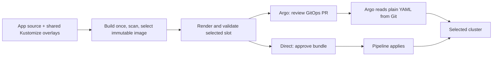

# Choose how the application reaches Kubernetes

Both methods are exercised in the [deployment testing system](deployment-testing-system.md), a disposable two-cluster rehearsal with recorded runtime evidence and an explicit path to live Azure qualification.

Kustomize and Argo CD do different jobs. Kustomize builds Kubernetes YAML from a base and environment/cluster overlays. Argo CD reads the desired state from Git, compares it with a cluster, and reconciles it. Argo supports plain YAML, Kustomize and Helm. Using Kustomize with Argo is normal, but it is optional: see the official [Kustomize](https://argo-cd.readthedocs.io/en/stable/user-guide/kustomize/) and [directory](https://argo-cd.readthedocs.io/en/stable/user-guide/directory/) documentation.

This reference provides two application delivery methods. Both use the existing Kustomize source, the same immutable image, slot configuration, manifest validation and HTTPS acceptance contract. Nothing in the original direct method is removed.

| Question | Direct pipeline deployment | Argo CD deployment |
| --- | --- | --- |
| Where is application configuration authored? | Shared Kustomize base and slot overlays in the private app repository | The same source |
| Who renders it? | The approved release pipeline, using the shared renderer | The GitOps proposal pipeline, using that same renderer |
| What is the approved deployment input? | An immutable manifest bundle and independently checked receipt | That same rendered bundle committed under the selected slot in Git |
| Who writes the workload to Kubernetes? | The scoped application deployment job | The Argo controller in that slot |
| Does Argo need Kustomize at reconciliation time here? | Not applicable | No. It reads the already rendered plain manifest |
| What starts an application release? | An approved selected-release deployment | A reviewed GitOps PR followed by explicit sync of its full commit |
| What detects drift continuously? | Additional monitoring or a subsequent verification | Argo compares live resources with Git |
| What changes active user traffic? | A separate approved Terraform/DNS/backend change | The same separate infrastructure change |

## Why render before committing the GitOps release?

The public templates already build and validate a target-specific bundle. Reusing it gives both delivery methods exactly the same workload, HTTPRoute, configuration, CSI, autoscaling and policy inputs. Reviewers can see the concrete image digest and cluster-specific YAML in a GitOps PR. A manifest checksum and release receipt remain beside it.

Argo's Application explicitly sets:

```yaml
source:
  repoURL: https://github.com/YOUR-ORG/private-platform-demo.git
  targetRevision: main
  path: gitops/releases/pprd/uks/aks01
  directory:
    include: manifest.yaml
    recurse: false
```

Only `manifest.yaml` is Kubernetes input. JSON receipts and an optional public CA certificate are evidence; they are not submitted as resources. There is no redundant generated Kustomize wrapper. Kustomize is still used upstream to avoid maintaining two independent application definitions.

An alternative design can point Argo directly at a Kustomize overlay and let its repository server render it. That is also a normal supported approach. It would need an equivalent image-promotion, target-configuration and review contract; it is not a third implemented release path in this example.

## Preserve the three tiers

1. **Infrastructure:** Terraform creates the network, private AKS slots, identities, registry and WAF.
2. **Platform:** separately approved pipelines install namespaces, CRDs, Envoy Gateway, listeners and Argo itself.
3. **Application:** choose direct delivery or Argo for a particular application and cluster.

Argo does not replace the container build, vulnerability gate, Terraform or the platform lifecycle. It replaces the application's imperative apply with Git-based reconciliation. Installation of Argo alone does not automatically adopt existing resources.



The two arrows into the cluster represent a choice, not simultaneous writers. Existing direct workloads keep their deployment method until an operator explicitly changes ownership.

## Choose and switch deliberately

Use direct deployment when you want the existing approved-job workflow. Use Argo when you want Git to hold desired application releases, continuous drift visibility and Argo's reconciliation UI.

For an existing app, first record the live digest, source revision, namespace and resources. Pause direct application deployment for the chosen slot, establish Argo, and review a GitOps proposal for that same release. Inspect its diff before the first manual sync. Confirm annotation tracking, resource ownership and HPA replica handling, then verify the selected Service and HTTPS route.

When returning to direct delivery, stop any running Argo operation, ensure automated sync is absent, and detach the Application without cascading resource deletion before restoring the pipeline as writer. The [operations guide](argocd-operations.md) contains the detailed handover and rollback procedures.

Never allow both controllers to manage the same application resources. Neither changing delivery method nor synchronizing an inactive slot changes Application Gateway's traffic target.

## Guides

- Direct: [first deployment](getting-started.md), [selected-build promotion](promotion.md), [operator walkthrough](operators-walkthrough.md).
- Argo: [design](argocd-design.md), [deployment](argocd-deployment.md), [operations](argocd-operations.md), [troubleshooting](argocd-troubleshooting.md).
- Complete Azure trial: [sandbox deployment](https://github.com/MikeeeGit/terraform-delivery-templates/blob/main/docs/azure/sandbox-deployment.md).
- Executable application and caller recipes: [aks-platform-demo](https://github.com/MikeeeGit/aks-platform-demo).
