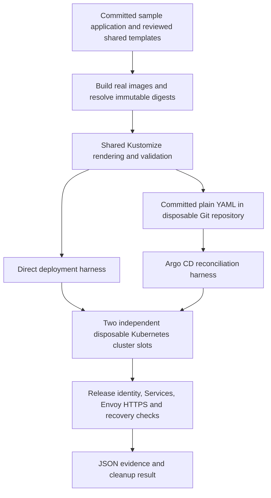

# A repeatable application deployment rehearsal

This project includes a self-contained integration test environment for the dual-cluster application delivery lifecycle. It builds real application images, creates two disposable Kubernetes clusters, installs real controllers, deploys the sample application and exercises release changes and recovery. Both direct pipeline deployment and Argo CD delivery are implemented and tested.

The engineering value is that delivery behavior can be changed and rehearsed before provisioning Azure infrastructure. The tests connect the application, shared deployment helpers, configuration rendering, controllers and verification into an executable system. They go beyond checking whether YAML parses or whether individual commands were called.

Here, **self-contained** means the harness creates and cleans up its own deployment environment. It is not an offline or completely hermetic environment: it requires a Docker-capable Linux worker and access to pinned tools, images and upstream assets. It does not emulate every Azure service or prove a complete live Azure installation.

## How the pieces fit together

The two methods have separate harness runs and reports. This diagram does not mean both write the same application at once. In the Argo run, Argo owns application reconciliation; Kustomize renders its desired configuration upstream. Infrastructure, platform installation and application delivery retain their separate responsibilities.

The executable harnesses live in [aks-platform-demo](https://github.com/MikeeeGit/aks-platform-demo). They use the delivery code from this repository rather than maintaining an unrelated test implementation. Their fixtures deliberately substitute local equivalents where Azure services would otherwise be required.

## What the tests exercise

| Capability | Direct delivery | Argo CD delivery |
| --- | --- | --- |
| Build and push real images to a disposable registry; verify content digests | Yes | Yes |
| Render committed Kustomize configuration through the shared helper | Yes | Yes |
| Install real Envoy/Gateway API controllers on two clusters | Yes | Yes |
| Deploy an initial release to both slots | Yes | Yes |
| Update only the inactive slot and preserve the active release | Yes | Yes |
| Roll back and verify the restored application | Reapply the original bundle | Commit the original desired release back to Git and reconcile |
| Verify Service responses and actual Envoy HTTPS, including Host/SNI rejection | Yes | Yes |
| Reject an invalid Deployment, then recover | Not a separate acceptance scenario | Yes |
| Detect live drift and repair it from Git | Not a continuous reconciler | Yes |
| Exercise scoped controller authorization and HPA with live metrics | Not a separate acceptance scenario | Yes |
| Retain evidence and fail on incomplete work or cleanup errors | Yes | Yes |

Unit and contract tests add checks that complement these runtime tests: immutable receipt binding, wrong-target refusal, manifest tampering, failed-scan handling, manual sync enforcement and review-only GitOps proposal behavior. Some external calls are mocked at this layer. A mocked scanner or proposal API is not evidence of a real vulnerability scan or successful private-repository authentication.

## Recorded acceptance evidence

On 17 September 2026, [GitHub run 35233451326](https://github.com/MikeeeGit/aks-platform-demo/actions/runs/35233451326) passed both runtime suites with application commit `344e6aa523b8fe4f06a9fb33bd362b1defd115f6` and shared templates commit `8d81e1fcee4732726fc7e5f6cafbb815c9a68243`. Its downloaded reports were checked for completed scenarios and empty cleanup error lists.

- Direct acceptance recorded five runtime checks and two distinct built image digests.
- Argo acceptance recorded nine reconciliation/state checks, eight application/HTTPS checks, 24 authorization probes and three HPA checks, with two distinct built image digests.
- Shared-template validation passed 122 tests; the application passed 51 Python tests and 11 Node tests.

Azure Pipelines also passed both runtime suites in required policy builds [795](https://dev.azure.com/Mrmichaelflynn/AzureInfraCode/_build/results?buildId=795) and [796](https://dev.azure.com/Mrmichaelflynn/AzureInfraCode/_build/results?buildId=796). Those builds used PR merge commits whose Git trees were verified equal to the application candidate. Their task records and runtime logs were inspected; downloading their report artifacts was denied by the artifact endpoint. The Azure project is private, so those links require access. Running on Azure Pipelines hosted workers is not the same as deploying to AKS.

These are dated results for identified source revisions, not a guarantee that every future revision passes. CI artifacts also have retention limits. Keep the reports and source/tool pins needed for any release decision in your own protected evidence store.

## What still needs an Azure rehearsal

| Fixture or offline check | Live qualification still required |
| --- | --- |
| kind clusters and local container registry | Private AKS APIs, Entra authorization, real ACR push/scan/pull and worker connectivity |
| Temporary CA and Kubernetes TLS Secret | Workload identity, Key Vault access, CSI mounting/synchronization and certificate renewal |
| ClusterIP transport and port-forwarded Envoy requests | Azure internal load balancer allocation, routing, private DNS and frontend reachability |
| Local controller RBAC probes | Actual cloud/deployer identities and the chosen Azure authorization model |
| NetworkPolicy manifests | Enforcement by the selected production CNI and real allowed/denied traffic |
| Provider-mocked Terraform checks | Azure resource creation, quota, regional availability, permissions and state/backend behavior |
| Application/Envoy HTTPS acceptance | Application Gateway backend trust, health probes, WAF, public DNS and deliberate traffic cutover/rollback |
| Evaluation Argo profile and synthetic Git service | Private Git credentials/policies, SSO, HA failure tolerance and operational recovery |

The fixture's test-only metrics-server setting and certificate/registry substitutions belong only to the disposable environment. The tests do not establish production-scale performance, zero downtime, regional disaster recovery or data/schema rollback. The sample application is intentionally small; a real application's databases and external dependencies need additional scenarios.

## Develop here, then qualify the live integration

1. **Develop and review.** Change the application, configuration or shared delivery implementation; run the focused local checks described in [shared verification](testing.md) and the [application testing guide](https://github.com/MikeeeGit/aks-platform-demo/blob/main/docs/TESTING.md).
2. **Rehearse both delivery methods.** Run the disposable-cluster harnesses on a Docker-capable worker or through the public CI workflows. Inspect each method's report independently. Failed scenarios or cleanup are failures, not partial acceptance.
3. **Prepare a private Azure consumer.** Pin the reviewed templates and configure real identities, addresses, certificates, protected environments and connectivity using the [sandbox runbook](https://github.com/MikeeeGit/terraform-delivery-templates/blob/main/docs/azure/sandbox-deployment.md).
4. **Qualify the Azure integration.** Build and scan the real application release in the trusted pipeline, then rehearse both slots and the cloud-specific checks above. The harness creates synthetic source revisions and registry/certificate fixtures: its temporary images and credentials are not production release artifacts.
5. **Promote deliberately.** Promote the approved immutable application image through the intended live environments, rendering their reviewed target configuration. Choose one application deployment owner per slot. Verify the candidate before separately approving traffic switching; retain the prior approved release and a tested recovery procedure.

The result is a repeatable way to find delivery defects early, compare two deployment methods against the same application contract, and carry explicit evidence into an Azure rehearsal. It reduces the unknowns before live deployment; it does not remove that final qualification step.

## Where to go next

- [Choose direct or Argo CD delivery](delivery-methods.md)
- [Three-tier platform architecture](three-tier-deployment-system.md)
- [Harness prerequisites, execution commands and report limitations](https://github.com/MikeeeGit/aks-platform-demo/blob/main/docs/TESTING.md)
- [Argo design](argocd-design.md), [operations](argocd-operations.md) and [troubleshooting](argocd-troubleshooting.md)
- [Full Azure sandbox deployment sequence](https://github.com/MikeeeGit/terraform-delivery-templates/blob/main/docs/azure/sandbox-deployment.md)
